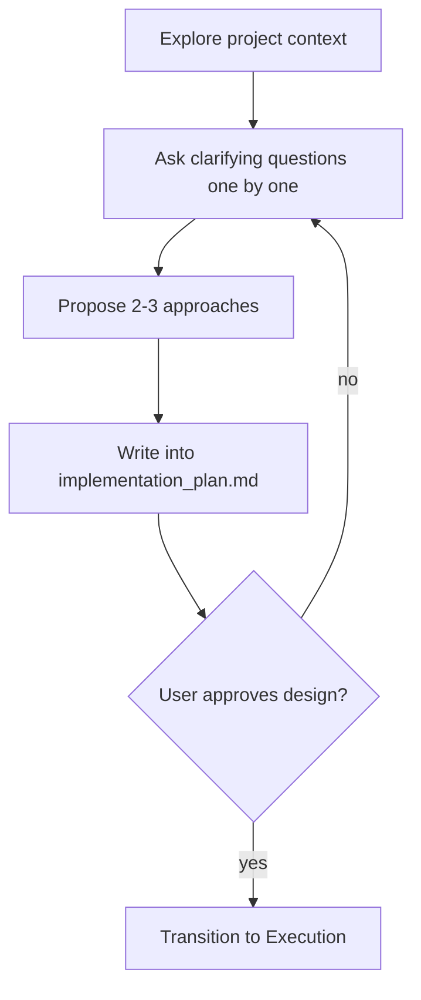

# Brainstorming Ideas Into Designs (Antigravity Edition)

Help turn ideas into fully formed designs and specs through natural collaborative dialogue.

Start by understanding the current project context, then ask questions one at a time to refine the idea. Once you understand what you're building, present the design and get user approval by generating an `implementation_plan.md` artifact.

<HARD-GATE>
Do NOT invoke any implementation skill, write any code, scaffold any project, or take any implementation action until you have presented an implementation plan and the user has approved it. This applies to EVERY project regardless of perceived simplicity.
</HARD-GATE>

## Anti-Pattern: "This Is Too Simple To Need A Design"

Every project goes through this process. A todo list, a single-function utility, a config change — all of them. "Simple" projects are where unexamined assumptions cause the most wasted work.

## Checklist

You MUST complete these items in order:

1. **Explore project context** — check files, docs, recent commits
2. **Ask clarifying questions** — one at a time, understand purpose/constraints/success criteria
3. **Propose 2-3 approaches** — with trade-offs and your recommendation
4. **Present design via Artifact** — create an `implementation_plan.md` artifact incorporating your design and request user review natively.
5. **Transition to execution** — once approved, proceed to `ag-executing-plans`

## Process Flow

## The Process

**Understanding the idea:**

- Check out the current project state first using `list_dir` and `view_file` on relevant files.
- Before asking detailed questions, assess scope. If the project is too large for a single spec, help the user decompose into sub-projects.
- For appropriately-scoped projects, ask questions **one at a time** to refine the idea.
- Prefer multiple choice questions when possible, but open-ended is fine too.
- Only one question per message - if a topic needs more exploration, break it into multiple questions.

**Exploring approaches:**

- Propose 2-3 different approaches with trade-offs.
- Present options conversationally with your recommendation and reasoning.

**Presenting the design:**

- Use `write_to_file` to draft the `implementation_plan.md` artifact explicitly.
- Set `RequestFeedback: true` on the artifact creation so the user is forced to approve it before you proceed to execution.

**Visual Verification:**
- If the project has UI features and the user has stated visual approval is necessary, remind the user you have a `browser_subagent` that can be utilized *during execution* to verify the UI.

## After the Design

Once the user approves the `implementation_plan.md`:
1. Use `write_to_file` to create a `task.md` tracking list containing all subtasks.
2. Proceed to execute the plan step-by-step.
