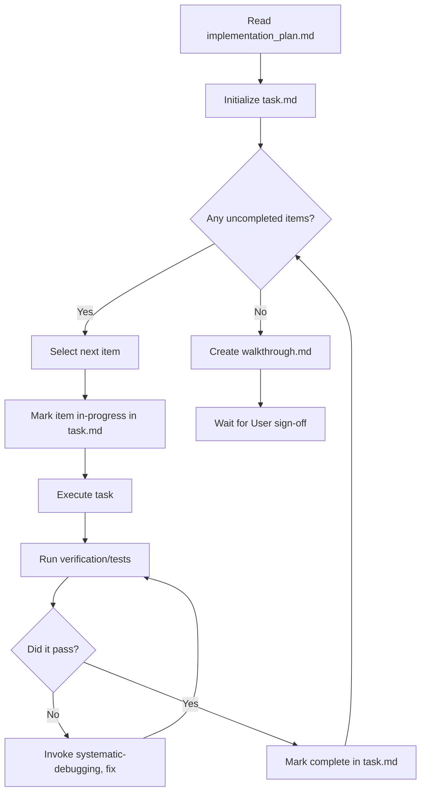

# Batch Execution and Task Management

This skill ensures you methodically execute plans without losing context, getting overwhelmed, or drifting from the spec. It relies entirely on Antigravity's `task.md` artifact to track progress.

## The Rule

**Never hold a task checklist in your head. Never skip task checkpoints.**

Execution isn't a race to the finish line—it's a structured progression where you pause to verify against spec after each logical step. If you diverge, you must stop, report the divergence, and ask to update the plan.

## The Checklist Loop

## 1. Setup Phase

If an `implementation_plan.md` already exists, read it.

Then use `write_to_file` to create the `task.md` artifact:
- Break the implementation plan down into 5-10 minute tasks.
- Keep them granular ("Add submit handler", "Style button") not vague ("Build signup flow").
- Tasks must be independent where possible.

## 2. Execution Phase

For EACH task, strictly follow this loop:

### Step A: Mark In Progress
Use `replace_file_content` to change `[ ]` to `[/]` for the current task in `task.md`.

### Step B: Execution
Work on the specific task. Do NOT bleed over into other tasks or try to do "just one more thing" not listed in the current task. If the task is related to UI or involves frontend behaviors, strongly consider writing a test first (TDD).

### Step C: Verification
Before marking a task as done, verify it:
- Run tests.
- If it is UI, run the dev server (`run_command`) and optionally ask the user to view it visually, OR dispatch your `browser_subagent`.

### Step D: Mark Completed
Use `replace_file_content` to change `[/]` to `[x]` for the completed task in `task.md`.

## 3. Reporting and Completion

After checking off all items in the `task.md`:
1. Final end-to-end verification (run comprehensive test suites).
2. Generate a `walkthrough.md` artifact documenting exactly what was built, how to test it, and any follow-up actions required.
3. Yield to the user for final sign-off.

## Red Flags - STOP

- Executing a task without marking it `[/]` in `task.md`.
- Marking a task `[x]` before running tests or verification.
- "I'll just add this minor feature while I'm at it" (Scope bleed).
- Updating `task.md` with 5 completed items at once instead of one by one.
