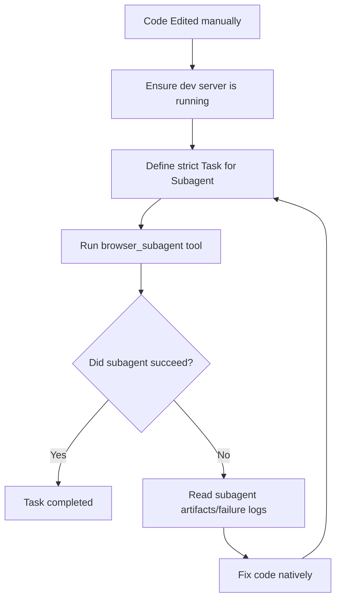

# Visual Browser Verification

Antigravity operates a unique and powerful tool: the **`browser_subagent`**. This subagent provides visual ground-truth to your code modifications.

Instead of guessing if Tailwind classes applied correctly or if a React form works by reading the source code, you dispatch the visual agent to see it, interact with it, and record a video.

## When to Use

- Any CSS, HTML, or Frontend JS change.
- Fixing responsive layouts.
- Developing interactive components (modals, forms, dropdowns).
- Validating routing in Single Page Applications.

## The Workflow

## Step 1: Ensure Localhost is Running
Before using the browser subagent, ensure that the application is actively serving traffic (e.g., via `npm run dev` in a detached `run_command`, or verify it is already running).

## Step 2: Define a Strict Subagent Task
Do not dispatch the subagent arbitrarily. Give it a comprehensive instruction:

<Good>
"Navigate to `http://localhost:3000/login`. Ensure the page loads. Take a screenshot of the login form. Click the Submit button without filling anything out, and read the DOM to ensure a red validation error appears."
</Good>

<Bad>
"Check if the login page works."
</Bad>

## Step 3: Dispatch Subagent
Invoke the `browser_subagent` tool via your default API.
Provide a clear `Task`, `TaskName` (e.g. "Login Verification"), and `RecordingName` (e.g. "login_error_test").

## Step 4: Analyze Result
The subagent will return what it did. You MUST read this report. 
- If it errored because the port wasn't exposed, re-read Step 1.
- If it captured a screenshot showing a broken layout, proceed to the `systematic-debugging` skill.

## Red Flags - STOP

- Saying "The code looks right" when dealing with UI. Code does not guarantee visual manifestation.
- Asking the user to "please deploy and check if the margins look okay". That is YOUR job via the `browser_subagent`.
