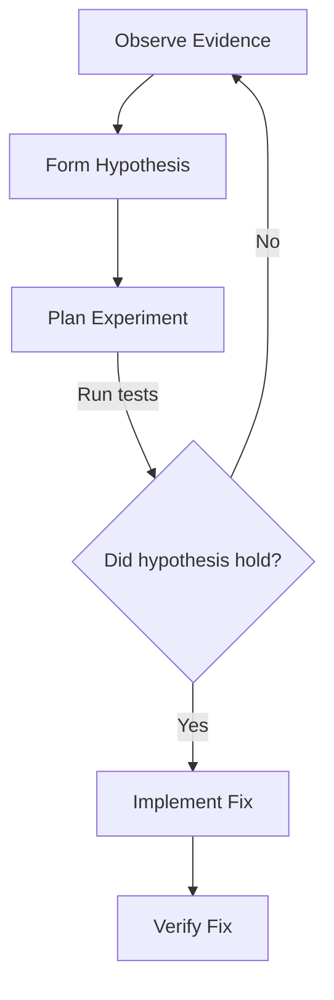

# Systematic Debugging

Debugging isn't guessing until it works. It's a scientific process of creating hypotheses, verifying them, and implementing fixes that last.

## Anti-Pattern: "Let me just try this..."

If you are changing code before explicitly stating "The bug is caused by X because Y", you are guessing. Stop guessing.

## The Process

## Step 1: Document Evidence (The Plan)

When a bug occurs during `ag-executing-plans`, PAUSE.
Use `write_to_file` to update the `implementation_plan.md` artifact (or `task.md` if simple) with a **Debugging Hypothesis Section**:
1. What is the behavior?
2. What is the expected behavior?
3. What is the stack trace or error log? (run `command_status` or `run_command` with grep to gather it).

## Step 2: Establish the Hypothesis

Before changing **any code**:
Write down exactly what you think is wrong in the artifact:
"I hypothesize the state is null because the component mounts before the router is ready."

## Step 3: Run the Experiment

Do not "just fix it". Use `grep_search` to verify if your theory is even possible in the codebase. Write a failing test using TDD (see `test-driven-development` skill).
If the test fails for the expected reason, your hypothesis is solid.

## Step 4: Implement

Use `replace_file_content` to fix the bug.

## Red Flags - STOP

- Making code changes without writing a hypothesis or a failing test.
- Changing 5 files at once hoping it "fixes everything".
- "It works now, but I'm not sure why." (If you don't know why, you haven't fixed the bug, you've just hidden it.)
