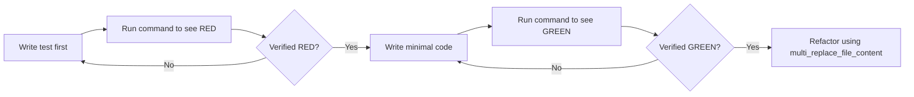

# Test-Driven Development (TDD) natively in Antigravity

Write the test first. Watch it fail. Write minimal code to pass.

## The Iron Law

```
NO PRODUCTION CODE WITHOUT A FAILING TEST FIRST
```

Write code before the test? Delete it. Start over.

## The Cycle



## 1. RED
Before updating production files with `write_to_file` or `replace_file_content`, use your tools to write a test case to a `.test.ts`, `.spec.js`, or similar file.

## 2. Verify RED
Use `run_command` to execute the exact test file (e.g. `npm run test -- /path/to/test.spec.ts`).
Observe the failure in the terminal output. It MUST fail for the exact reason you expect (e.g. "expected Output, got Undefined").

## 3. GREEN
Now, and only now, write or modify the production code using `replace_file_content` to satisfy the test.

## 4. Verify GREEN
Use `run_command` again. It must pass.

## Dealing with State and UI
If you are building complex UI without tests (because of user constraints), you MUST default to visual verification using the `browser_subagent`. Test Driven Development is non-negotiable for backend logic.

## Common Rationalizations
| Excuse | Reality |
|--------|---------|
| "Too simple to test" | Simple code breaks. Test takes 30 seconds. |
| "I'll test after" | Tests passing immediately prove nothing. |
| "Already manually tested" | Ad-hoc ≠ systematic. No record, can't re-run. |
| "Deleting X hours is wasteful" | Sunk cost fallacy. Keeping unverified code is technical debt. |
