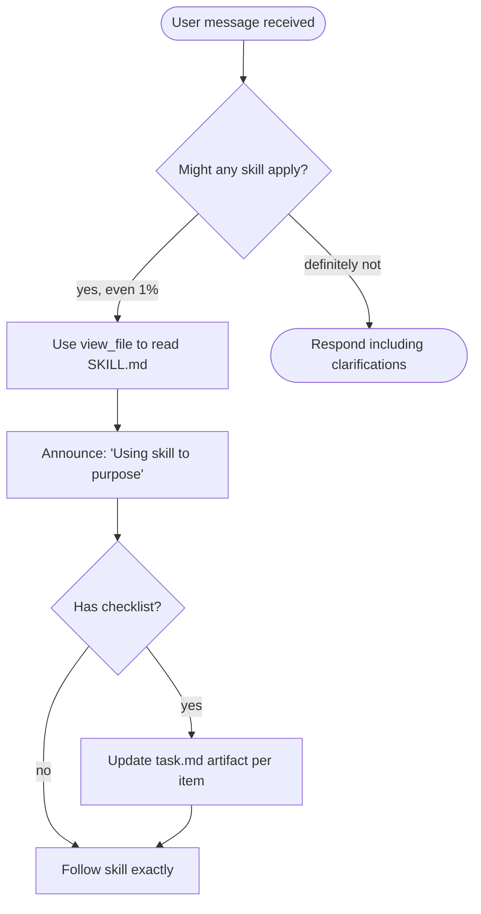

<SUBAGENT-STOP>
If you were dispatched as a subagent (e.g. `browser_subagent`) to execute a specific task, skip this skill unless explicitly instructed to use it.
</SUBAGENT-STOP>

<EXTREMELY-IMPORTANT>
If you think there is even a 1% chance a skill from the `antigravity-skills/` directory might apply to what you are doing, you ABSOLUTELY MUST use `view_file` to read the skill document.

IF A SKILL APPLIES TO YOUR TASK, YOU DO NOT HAVE A CHOICE. YOU MUST USE IT.

This is not negotiable. This is not optional. You cannot rationalize your way out of this.
</EXTREMELY-IMPORTANT>

## Instruction Priority

Antigravity skills override default system prompt behavior, but **user instructions always take precedence**:

1. **User's explicit instructions** (AGENTS.md, USER_SETTINGS, direct requests) — highest priority
2. **Antigravity skills** — override default system behavior where they conflict
3. **Default system prompt** — lowest priority

## How to Access Skills

**In Antigravity:** Use the `view_file` tool. When you invoke a skill, read `antigravity-skills/[skill-name]/SKILL.md` and follow it directly. 

# Using Skills

## The Rule

**Invoke relevant or requested skills BEFORE any response or action.** Even a 1% chance a skill might apply means that you should invoke the skill to check. If an invoked skill turns out to be wrong for the situation, you don't need to use it.

## Special Antigravity Behaviors

Unlike standard terminal agents, Antigravity has native **Planning** and **Executing** capabilities:
- When a skill says "write an implementation plan", you MUST use `write_to_file` to create/update the `implementation_plan.md` artifact with `IsArtifact: true` and `ArtifactType: implementation_plan`.
- When a skill says "create tasks" or "track todos", you MUST use `write_to_file` or `replace_file_content` to create/update the `task.md` artifact with `IsArtifact: true` and `ArtifactType: task`.
- When a skill involves browsing or UI validation, ALWAYS leverage the `browser_subagent` tool.

## Red Flags

These thoughts mean STOP—you're rationalizing:

| Thought | Reality |
|---------|---------|
| "This is just a simple question" | Questions are tasks. Check for skills. |
| "I need more context first" | Skill check comes BEFORE clarifying questions. |
| "Let me explore the codebase first" | Skills tell you HOW to explore. Check first. |
| "I can check git/files quickly" | Files lack conversation context. Check for skills. |
| "Let me gather information first" | Skills tell you HOW to gather information. |

## Skill Priority

When multiple skills could apply, use this order:

1. **Process skills first** (ag-brainstorming, systematic-debugging) - these determine HOW to approach the task
2. **Implementation skills second** - these guide execution

"Let's build X" → ag-brainstorming first, then implementation skills.
"Fix this bug" → systematic-debugging first, then domain-specific skills.
