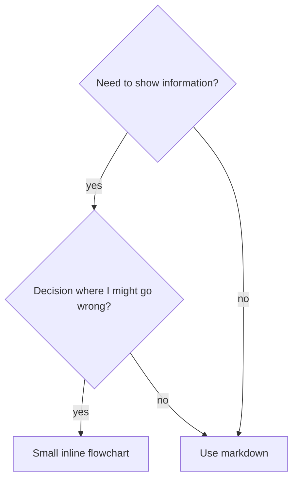

# Writing Antigravity Skills

## Overview

**Writing skills IS Test-Driven Development applied to process documentation.**

You write test cases, watch them fail (baseline behavior), write the skill (documentation), watch tests pass (agents comply), and refactor (close loopholes).

**Official guidance:** This document adapts the standard Superpowers approach specifically for Antigravity's capabilities, primarily focusing on Markdown artifacts, replacing Graphviz with Mermaid, and relying on `task.md`.

## TDD Mapping for Skills

| TDD Concept | Skill Creation |
|-------------|----------------|
| **Test case** | Pressure scenario in Antigravity |
| **Production code** | Skill document (SKILL.md) |
| **Test fails (RED)** | Agent violates rule without skill (baseline) |
| **Test passes (GREEN)** | Agent complies with skill present |
| **Refactor** | Close loopholes while maintaining compliance |

## Directory Structure
```
antigravity-skills/
  skill-name/
    SKILL.md              # Main reference (required)
    supporting-file.*     # Only if needed
```

## SKILL.md Structure

**Frontmatter (YAML):**
- Two required fields: `name` and `description`
- `name`: Use letters, numbers, and hyphens only
- `description`: Third-person, describes ONLY when to use (NOT what it does). Start with "Use when..."

```markdown
---
name: Skill-Name-With-Hyphens
description: Use when [specific triggering conditions and symptoms]
---

# Skill Name

## Overview
What is this? Core principle in 1-2 sentences.

## When to Use
[Mermaid flowchart IF decision non-obvious]

Bullet list with SYMPTOMS and use cases
When NOT to use
```

## Keyword Coverage & Optimization
Use words Antigravity would search for or trigger on based on context:
- Error messages: "Hook timed out"
- Symptoms: "flaky", "hanging"

Make sure NOT to summarize the process in the description. Just the triggers!

## Flowchart Usage (Mermaid ONLY)

Antigravity natively renders **Mermaid** graphs into the UI. Do **NOT** use `dot` or Graphviz syntax.



**Use flowcharts ONLY for:**
- Non-obvious decision points
- Process loops where you might stop too early

## Antigravity-Specific Instructions

When authoring steps for your skill, you cannot mention tools like `TodoWrite` or `EnterPlanMode`. Instead, use Antigravity terminology:
1. **To Track Tasks**: Instruct the agent to "Create/Update the `task.md` artifact".
2. **To Make a Plan**: Instruct the agent to "Create/Update the `implementation_plan.md` artifact".
3. **To Browse the Web/UI**: Instruct the agent to "Use the `browser_subagent`".

## The Iron Law

```
NO SKILL WITHOUT A FAILING TEST FIRST
```

Write skill before testing? Delete it. Start over. This ensures the documentation is actually needed to enforce the discipline.
